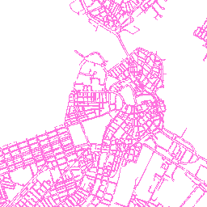
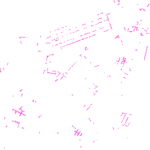

{::options parse_block_html="true" /}

## Query

* [Image](#image)
* [Tiles](#tiles)

### Image

Map services can also export the map as an image.

<pre>
http://gis.cityofboston.gov/arcgis/rest/services/Infrastructure/OpenData/MapServer/export?
bbox=-71.087379,42.348324,-71.041031,42.370142
&bboxSR=4326
&layers=show:0
&size=256,256
&imageSR=102100
&format=png
&transparent=true
&f=image
</pre>

[view live export](http://gis.cityofboston.gov/arcgis/rest/services/Infrastructure/OpenData/MapServer/export?bbox=-71.087379%2C42.348324%2C-71.041031%2C42.370142&bboxSR=4326&layers=show%3A0&layerDefs=&size=256%2C256&imageSR=102100&format=png&transparent=true&dpi=&time=&layerTimeOptions=&dynamicLayers=&gdbVersion=&mapScale=&f=image)

### Filter Images

Using the _layer definition_ you can generate a filtered image view.

<pre>
http://gis.cityofboston.gov/arcgis/rest/services/Infrastructure/OpenData/MapServer/export?
bbox=-71.087379,42.348324,-71.041031,42.370142
&bboxSR=4326
&layers=show:0
&layerDefs={ "0" : "SURVEY='MISSING SURVEY'"}
&size=256,256
&imageSR=102100
&format=png
&transparent=true
&f=image
</pre>

[view live export](http://gis.cityofboston.gov/arcgis/rest/services/Infrastructure/OpenData/MapServer/export?bbox=-7915207.152985686%2C5209947.84791703%2C-7910315.183175435%2C5214839.817727281&bboxSR=102100&layers=show%3A0&layerDefs=%7B+%220%22+%3A+%22SURVEY%3D%27MISSING+SURVEY%27%22%7D&size=256%2C256&imageSR=102100&format=png&transparent=true&dpi=&time=&layerTimeOptions=&dynamicLayers=&gdbVersion=&mapScale=&f=image)

